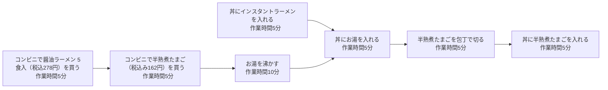

```mermaid
graph LR;
    1["コンビニで醤油ラーメン 5食入（税込278円）を買う
    作業時間5分"]
    2["コンビニで半熟煮たまご（税込み162円）を買う
    作業時間5分"]
    3["お湯を沸かす
    作業時間10分"]
    4["丼にインスタントラーメンを入れる
    作業時間5分"]
    5["丼にお湯を入れる
    作業時間5分"]
    6["半熟煮たまごを包丁で切る
    作業時間5分"]
    7["丼に半熟煮たまごを入れる
    作業時間5分"]
    1 --> 2 --> 3
    4 --> 5 --> 6 --> 7
    3 --> 5 
```