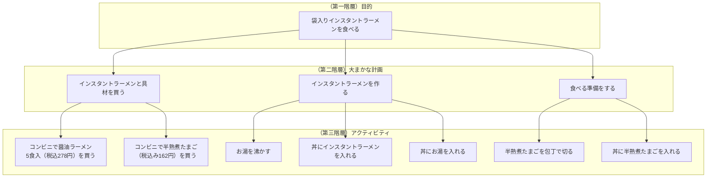

```mermaid
flowchart TB
    subgraph "（第一階層）目的"
    1[袋入りインスタントラーメンを食べる]
    end
    2[インスタントラーメンと具材を買う]
    3[インスタントラーメンを作る]
    4[食べる準備をする]
    5[コンビニで醤油ラーメン
     5食入（税込278円）を買う]
    6[コンビニで半熟煮たまご
    （税込み162円）を買う]
    7[お湯を沸かす]
    8[丼にインスタントラーメンを入れる]
    9[丼にお湯を入れる]
    10[半熟煮たまごを包丁で切る]
    11[丼に半熟煮たまごを入れる]
    subgraph "（第二階層）大まかな計画"
    1-->2 & 3 & 4
    end
    subgraph "（第三階層）アクティビティ"
    2-->5 & 6
    3-->7 & 8 & 9
    4-->10 & 11
    end
```