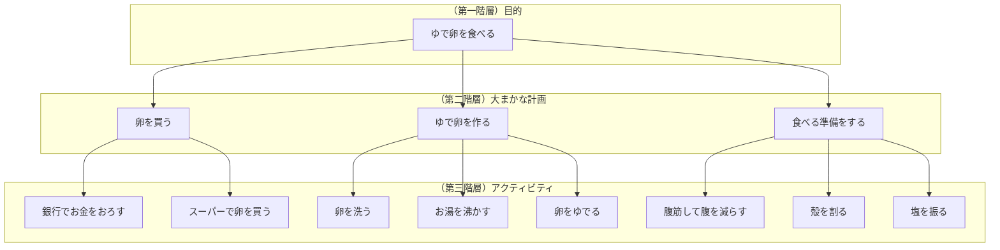

```mermaid
flowchart TB
    subgraph "（第一階層）目的"
    1[ゆで卵を食べる]
    end
    2[卵を買う]
    3[ゆで卵を作る]
    4[食べる準備をする]
    5[銀行でお金をおろす]
    6[スーパーで卵を買う]
    7[卵を洗う]
    8[お湯を沸かす]
    9[卵をゆでる]
    10[腹筋して腹を減らす]
    11[殻を割る]
    12[塩を振る]
    subgraph "（第二階層）大まかな計画"
    1-->2 & 3 & 4
    end
    subgraph "（第三階層）アクティビティ"
    2-->5 & 6
    3-->7 & 8 & 9
    4-->10 & 11 & 12
    end
```