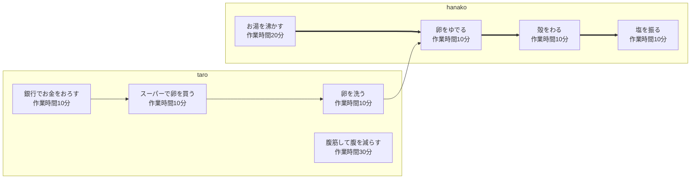

```mermaid
graph LR;
    1["銀行でお金をおろす
    作業時間10分"]
    2["スーパーで卵を買う
    作業時間10分"]
    3["卵を洗う
    作業時間10分"]
    4["お湯を沸かす
    作業時間20分"]
    5["卵をゆでる
    作業時間10分"]
    6["殻をわる
    作業時間10分"]
    7["塩を振る
    作業時間10分"]
    8["腹筋して腹を減らす
    作業時間30分"]
subgraph "taro"
 direction LR
 1--->2--->3;
   8
end
subgraph "hanako"
 4===>5===>6===>7;
end
 3--> 5
```